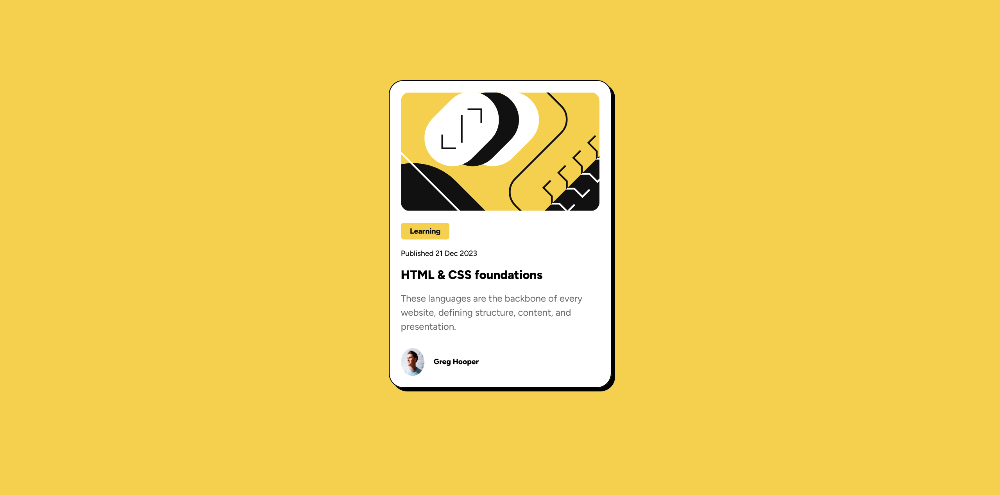

# Frontend Mentor - Blog preview card solution

This is a solution to the [Blog preview card challenge on Frontend Mentor](https://www.frontendmentor.io/challenges/blog-preview-card-ckPaj01IcS). Frontend Mentor challenges help you improve your coding skills by building realistic projects. 

## Table of contents

- [Overview](#overview)
  - [The challenge](#the-challenge)
  - [Screenshot](#screenshot)
  - [Links](#links)
- [My process](#my-process)
  - [Built with](#built-with)
  - [What I learned](#what-i-learned)
  - [Continued development](#continued-development)
  - [Useful resources](#useful-resources)
- [Author](#author)

## Overview

### The challenge

Users should be able to:

- See hover and focus states for all interactive elements on the page

### Screenshot

### Links

- Solution URL: [https://github.com/Alfonso-1701/Blog_Preview](https://github.com/Alfonso-1701/Blog_Preview)
- Live Site URL: [https://blogpreview11.netlify.app](https://blogpreview11.netlify.app)

## My process

Begain with HTML, then styled out the mobile version, from top to bottom. After everything was in place, added active states and a media query to scale for desktop.

### Built with

- Semantic HTML5 markup
- CSS custom properties
- Flex
- CSS Grid
- Mobile-first workflow

### What I learned

This project failed to bring new concepts to struggle on. That being said, it was great practice reinforcing the things I am familiar with. More great practice. 

### Continued development

Need to look up why "flex-box" didn't work but "flex" did. Want to know the difference and the differing use cases. 

Also want to look up the major differeces between using "id" and "class". They almost seem interchangable. I know class can be added to cover multiple uses of the same type, therefore limiting the amout of hard coding needed. But besides that, is one really better than the other.

### Useful resources

No resources used.

## Author

- Frontend Mentor - [@Alfonso-1701](https://www.frontendmentor.io/profile/Alfonso-1701)
- LinkedIn - [Alfonso ALvarez](https://www.linkedin.com/in/alfonso-alvarez-4223b628b/)

